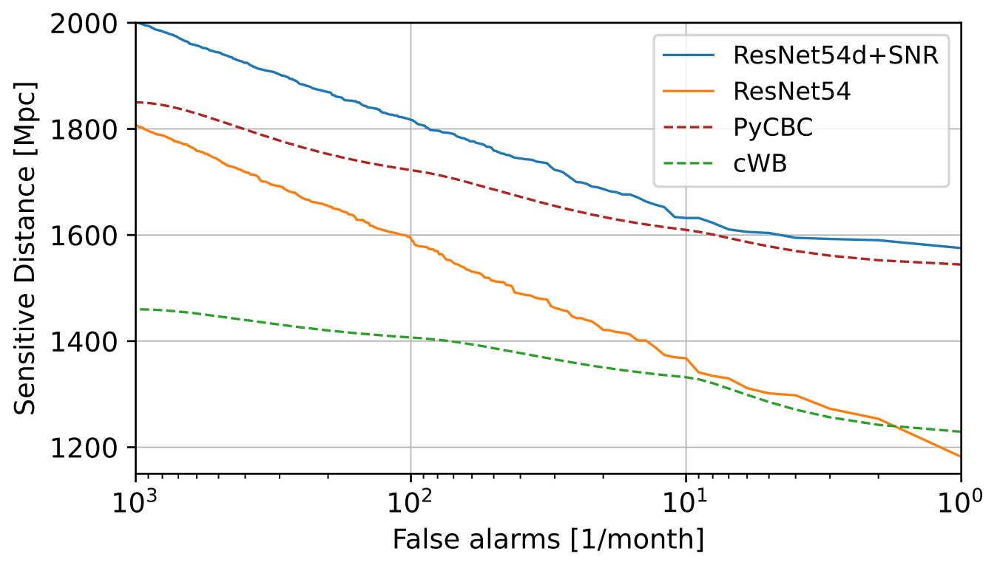

# AResGW: Augmentation and RESidual networks for Gravitational Wave detection
Gravitational wave detection in real noise timeseries using deep residual neural networks.

This repository contains the method submitted by our team, Virgo-AUTH, to the [MLGWSC](https://github.com/gwastro/ml-mock-data-challenge-1) competition.
Our method contains the following components:
1. A whitening module implemented in pytorch
2. An adaptive normalization layer ([DAIN](https://github.com/passalis/dain)) for non-stationary timeseries
3. A ResNet backbone with a depth of 54 layers
4. Training with over 600K samples and data augmentation methods
5. SNR estimation based curriculum learning



# Training

Training is handled by the `train.py` script, but the first step is data generation. 
1. From the [challenge repo](https://github.com/gwastro/ml-mock-data-challenge-1) use the `generate_data.py` script three times to generate a training, validation and test set. The result is stored in three HDF files per set, one for the background noise, one for the injection parameters and one for the foreground (background + injections).
2. Use the `utils/waveform_gen.py` script to generate the waveforms. Only the background and injections HDF files are needed for this step.
3. Run `train.py`. For a full list of available command line arguments, run `train.py -h`. Example run:
```shell
python3 train.py --output-dir runs/train_output_dir --slice-dur 4.25 --slice-stride 2 --learning-rate 1e-3 --lr-milestones 5,10 --gamma 0.5 --epochs 15 --warmup-epochs 1 --p-augment 0.2 --train-device cuda:0 --data-dir /home/administrator/datadir --batch-size 8
```
Note that this script expects the following data structure in the `--data-dir` folder:
```
data-dir
├── dataset-4                    
│   ├── v2
│   │   ├── train_background_s24w61w_1.hdf
│   │   ├── train_injections_s24w61w_1.hdf
│   │   ├── train_injections_s24w61w_1.25s_all.npy
│   │   ├── val_background_s24w6d1_1.hdf
│   │   ├── val_injections_s24w6d1_1.25s.npy
|   |   └── ...
└── ...
```
# Testing

## Challenge model

The `test_challenge_model.py` script is the main method used for testing the model we submitted to the challenge. Following the rules of the competition, this script expects only two inputs: the input foreground/background file (generated by [generate_data.py](https://github.com/gwastro/ml-mock-data-challenge-1/generate_data.py)), and the name of the file where the resulting predictions or events will be saved to.
An example of usage can be found in the `run_on_test.sh` script, explained below:
```shell
# creation of the directory where results will be saved
mkdir results
# run model on foreground, using GPU0 and save results
CUDA_VISIBLE_DEVICES="0" python3 deploy_model.py dataset-4/v2/test_foreground_s24w6d1_1.hdf results/test_fgevents_s24w6d1_1.hdf
# run model on background, using GPU0 and save results
CUDA_VISIBLE_DEVICES="0" python3 deploy_model.py dataset-4/v2/test_background_s24w6d1_1.hdf results/test_bgevents_s24w6d1_1.hdf
# the following files can be found in the original competition repository:
# https://github.com/gwastro/ml-mock-data-challenge-1
# and are required for evaluation and visualization of results
./evaluate.py --injection-file dataset-4/v2/test_injections_s24w6d1_1.hdf --foreground-events results/test_fgevents_s24w6d1_1.hdf --foreground-files dataset-4/v2/test_foreground_s24w6d1_1.hdf --background-events results/test_bgevents_s24w6d1_1.hdf --output-file results/test_eval_output_s24w6d1_1.hdf --verbose
python3 contributions/sensitivity_plot.py --files results/test_eval_output_s24w6d1_1.hdf --output results/test_eval_output_s24w6d1_1_plot.png --no-tex
```

## Improved & Custom Model

The `test.py` script handles testing of models trained with `train.py`. By default, our improved model will be loaded. This can be overwritten using the `--weights` argument.

```shell
mkdir results_best
# similarly, to run the improved model change test_challenge_model.py to test.py
CUDA_VISIBLE_DEVICES="0" python3 test.py dataset-4/v2/test_foreground_s24w6d1_1.hdf results_best/test_fgevents_s24w6d1_1.hdf # --weights path/to/your/weights.pt
CUDA_VISIBLE_DEVICES="0" python3 test.py dataset-4/v2/test_background_s24w6d1_1.hdf results_best/test_bgevents_s24w6d1_1.hdf # --weights path/to/your/weights.pt
# these scripts are part of the MLGWSC repository (https://github.com/gwastro/ml-mock-data-challenge-1)
./evaluate.py --injection-file dataset-4/v2/test_injections_s24w6d1_1.hdf --foreground-events results_best/test_fgevents_s24w6d1_1.hdf --foreground-files dataset-4/v2/test_foreground_s24w6d1_1.hdf --background-events results_best/test_bgevents_s24w6d1_1.hdf --output-file results_best/test_eval_output_s24w6d1_1.hdf --verbose
python3 contributions/sensitivity_plot.py --files results_best/test_eval_output_s24w6d1_1.hdf --output results_best/test_eval_output_s24w6d1_1_plot.png --no-tex
```

# Citations

You can refer to results produced with this code as "**AresGW model 1**", adding the following reference:

<pre>
@article{aresgw2022,
  title={Deep Residual Networks for Gravitational Wave Detection},
  author={Nousi, Paraskevi and Koloniari, Alexandra E and Passalis, Nikolaos and Iosif, Panagiotis and Stergioulas, Nikolaos and Tefas, Anastasios},
  journal={arXiv preprint arXiv:2211.01520},
  year={2022}
}
</pre>

# Enhanced versions

An enhanced version, **AresGW model 2**,  was introduced in this 2024 publication: https://arxiv.org/abs/2407.07820 . It was used to verify the majority of known detections within its training ranges, including a calculation of the astrophysical probability (p_astro). With AresGW model 2, we also found 8 new candidate events with p_astro > 0.5 ! 
